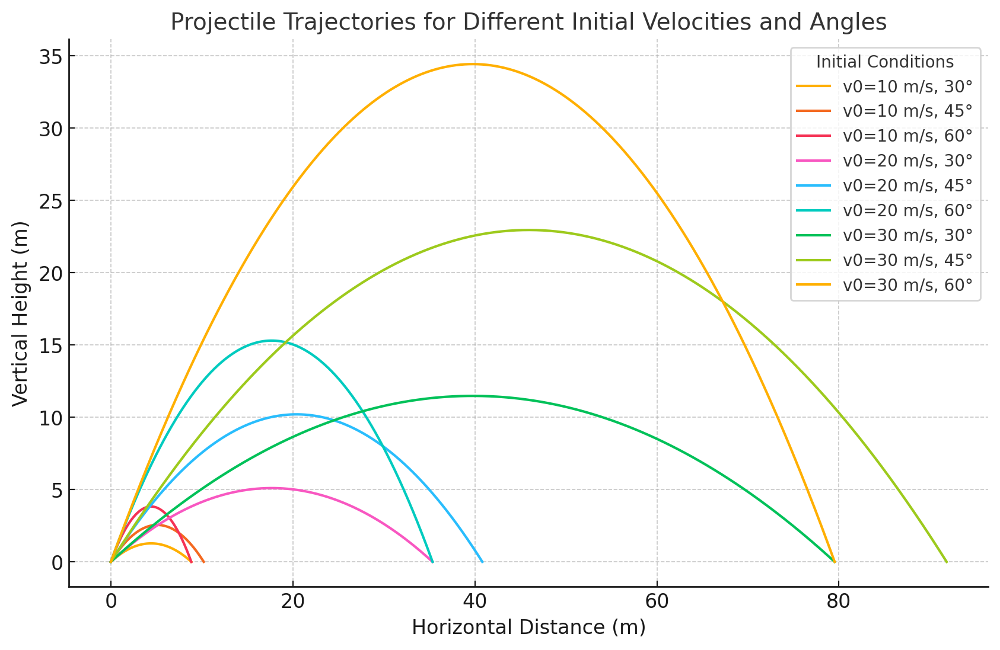

# Problem 1 

## 1.1 Investigating the Range as a Function of the Angle of Projection;

When you throw an object (like a ball) into the air, how far it travels horizontally depends on the angle at which you throw it. This angle is the angle the ball makes with the ground when thrown.

1. **Low Angles (0-30 degrees):** If you throw the ball at a low angle close to the ground, it won’t travel far before hitting the ground. So, the range will be short.
   
2. **Medium Angles (30-60 degrees):** If you throw the ball at a steeper angle (around 45 degrees), it will travel farther. These angles generally give the best range.

3. **High Angles (60-90 degrees):** If you throw the ball almost straight up, it will stay in the air longer, but won’t travel very far. The range will be short again.

The formula for the range \( R \) of a projectile is:

$$
R = \frac{{v_0^2 \sin(2\theta)}}{g}
$$

Where:

- ($ R $) is the range (how far the object travels horizontally).
- ($ v_0 $) is the initial velocity (the speed at which the object is thrown).
- $ \theta $ = $ 45^\circ $ is the angle of projection (the angle the object is thrown at relative to the ground).
- ($ g $) is the acceleration due to gravity (approximately $ 9.8 \, \text{m/s}^2 $).

In this formula, you can see that the range depends on both the initial speed and the angle. The best range is achieved when the angle is around 45 degrees because $ \sin(90^\circ) $ = 1 , giving the maximum possible range.

-----

## 1.2 Horizontal and Vertical Motion

### **Horizontal Motion (x-direction)**

The horizontal motion occurs at a constant velocity because we are ignoring air resistance. We start with Newton’s second law:

$$
F_x = ma_x
$$

Since there is no force acting on the object in the horizontal direction, the acceleration is zero, \( a_x = 0 \). This means the horizontal velocity is constant. The equation for horizontal motion is:

$$
x(t) = v_{0x} t = v_0 \cos(\theta) t
$$

### **Vertical Motion (y-direction)**

In the vertical direction, the object is affected by gravity, so it accelerates downward. Newton’s second law:

$$
F_y = ma_y = -mg
$$

Solving this equation gives the vertical velocity as a function of time. The initial vertical velocity is $ v_{0y} = v_0 \sin(\theta) $, so:

$$
v_y(t) = v_{0y} - g t = v_0 \sin(\theta) - g t
$$

To find the vertical position as a function of time, we integrate the velocity:

$$
y(t) = v_{0y} t - \frac{1}{2} g t^2 = v_0 \sin(\theta) t - \frac{1}{2} g t^2
$$

----

## 1.3 Changes in Launch Angle and Initial Velocity
 **Changes in Launch Angle**:
The launch angle $ \theta $ determines how steep or flat the projectile is launched. Different launch angles affect the projectile's trajectory in the following ways:

- **Low angles** (e.g. 15°): The projectile follows a flatter path and reaches the ground quickly, covering less horizontal distance.
- **Medium angles** (e.g. 45°): The projectile achieves a good balance of horizontal distance and vertical height, reaching the ***maximum range***.
- **High angles** (e.g. 75°): The projectile follows a steeper path, reaching a higher vertical height but covering less horizontal distance.

 **Changes in Initial Velocity**:
The initial velocity \( v_0 \) is the speed at which the projectile is launched. Increasing the initial velocity increases both the range and the height of the trajectory:

- **Low velocities**: The projectile travels a shorter distance and reaches a lower height.
- **High velocities**: The projectile covers a longer distance and reaches a greater height.

Changes in the initial velocity also lead to different solutions. Even with the same launch angle, increasing the initial velocity results in larger trajectories and longer ranges.

This graph shows the trajectories plotted for different initial velocities (10 m/s, 20 m/s, 30 m/s) and angles (30°, 45°, 60°). The following points stand out in the graph:

- As the initial velocity $ v_0 $ increases, the trajectories cover longer distances and reach higher altitudes.
- The maximum range occurs around 45° for a given initial velocity. For lower and higher angles, the range decreases, but the height varies.

-----

## **2.1 Analysis of the Range** 

### Dependence of Horizontal Range on the Projection Angle

The horizontal range $ R $ of a projectile depends on the launch angle and is given by the equation:  

$$
R = \frac{v_0^2 \sin(2\theta)}{g}
$$

Where:  
- $ v_0 $ is the initial velocity.  
- $ \theta $ is the launch angle.  
- $ g $ is the acceleration due to gravity (\( 9.8 \, \text{m/s}^2 \)).  

📌 **Effect of Launch Angle:**  

- When $ \theta = 0^\circ $ or $ 90^\circ $, the range is zero because:

  $$
  \sin(0) = 0, \quad \sin(180^\circ) = 0
  $$

- The **maximum range** occurs at $ 45^\circ $ because:

  $$
  \sin(90^\circ) = 1
  $$

- For angles lower or higher than $ 45^\circ $, the range decreases.  
----
### **2.2 Effect of Other Parameters**  

📌 **Effect of Initial Velocity:**  

- The range increases as the initial velocity $ v_0 $ increases.  
- If the launch angle is kept constant, a **higher initial velocity results in a longer range**.  
- Mathematically:

  $$
  R \propto v_0^2
  $$

📌 **Effect of Gravitational Acceleration:**  

- Since \( g \) is in the denominator, **an increase in gravity decreases the range**:  

  $$
  R \propto \frac{1}{g}
  $$

- If gravity is lower, the projectile will travel further.  

### **Summary**  

$$
\text{Maximum Range at } \theta = 45^\circ
$$

$$
R \text{ increases with } v_0
$$

$$
R \text{ decreases with } g
$$
----

## **3. Practical Applications**  

In real-world scenarios, projectile motion is influenced by additional factors such as **uneven terrain** and **air resistance**, which modify the ideal trajectory.  

### **3.1 Uneven Terrain**  

If the landing height differs from the launch height, the range equation must be modified. The general equation for projectile motion with different initial ($ y_0 $) and final heights ($ y_f $) is:  

$$
y_f = y_0 + v_0 \sin(\theta) t - \frac{1}{2} g t^2
$$

Solving for $ t $ and substituting into the range equation allows for trajectory adjustments on slopes.

---
### **3.2 Air Resistance**  

In real-world motion, air resistance applies a force opposite to the velocity, modifying both range and trajectory. The equation of motion considering drag force $ F_d = -kv $ leads to a more complex system:  

$$
m \frac{d v}{d t} = -mg - kv
$$

where $ k $ is the drag coefficient. As a result:
- The range is reduced ($ R < R_{ideal} $).
- The trajectory is no longer perfectly parabolic.  

---
### **3.3 Gravity Variations**  

On different planets, gravity $ g $ changes, affecting the range:  

$$
R = \frac{v_0^2 \sin(2\theta)}{g}
$$

For example, on the Moon ($ g \approx 1.63 \, \text{m/s}^2 $), the range increases significantly compared to Earth.  

### **Conclusion**  

In practical applications, projectile motion deviates from the idealized model due to environmental factors. By incorporating these effects, more accurate predictions can be made for fields such as **ballistics, sports, and space exploration**.

---

### 4.1 Projectile Motion: Effects of Gravity, Angle, and Initial Velocity

https://colab.research.google.com/drive/1mG9TDtRfRlfctXJZPtWLedPvlEVRCYe-#scrollTo=ypS30_zpL9aM

This graph visualizes the effects of different **initial velocities**, **angles**, and **gravity values** on **projectile motion**. Each line in the graph represents a different combination of **initial velocity**, **angle**, and **gravity**.

- **X-axis (Horizontal Distance):** Represents how far the object travels horizontally.
- **Y-axis (Vertical Distance):** Represents how high the object rises or how far it falls.

The graph shows how each of the following parameters affect projectile motion:

1. **Initial Velocity (v₀):** Higher initial velocities cause the object to travel further and reach greater heights.
2. **Angle (θ):** As the angle increases, the object reaches a higher point, but the horizontal distance decreases. An optimal angle (around 45°) gives the longest range.
3. **Gravity (g):** As gravity increases, the object falls faster, resulting in a shorter range.

This graph helps illustrate the varying effects of these parameters on projectile motion and provides insight into how each factor influences the object's trajectory.
