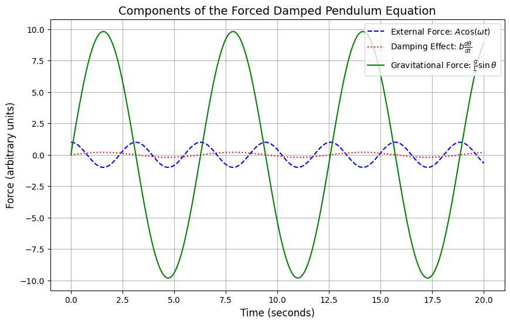

## **Theoretical Foundation: Forced Damped Pendulum**

### **Equation of Motion**
The equation governing the motion of a forced damped pendulum is given by:

$$
\frac{d^2\theta}{dt^2} + b\frac{d\theta}{dt} + \frac{g}{L}\sin\theta = A\cos(\omega t)
$$

where:
- $\theta$ is the angular displacement,
- $b$ is the damping coefficient,
- $g$ is the acceleration due to gravity,
- $L$ is the length of the pendulum,
- $A$ is the amplitude of the external force,
- $\omega$ is the driving frequency.

### **📌 Explanation of the Equation**
This equation describes the motion of a **pendulum that experiences friction (damping) and is influenced by an external periodic force**.

### **📘 Breakdown of Each Term**
1️⃣ **Acceleration Term:**  
   - $\frac{d^2\theta}{dt^2}$ → Represents the angular acceleration of the pendulum.  

2️⃣ **Damping (Friction) Term:**  
   - $b\frac{d\theta}{dt}$ → Represents energy loss due to friction or air resistance.  
   - **If $b$ is large** → The motion decays quickly (stops fast).  
   - **If $b$ is small** → The pendulum continues oscillating for a long time.  

3️⃣ **Gravitational Force Term:**  
   - $\frac{g}{L} \sin\theta$ → Represents the natural oscillation of the pendulum due to gravity.  

4️⃣ **External Force (Driving) Term:**  
   - $A\cos(\omega t)$ → Represents the external periodic force applied to the pendulum (e.g., a motor or external push).  
   - **If $A$ is large** → The pendulum swings more due to stronger external force.  
   - **If $\omega$ matches the natural frequency** → **Resonance occurs**, leading to very large oscillations.  

- The **blue dashed line** shows the **external force** applied to the pendulum, represented by $A \cos(\omega t)$.

- The **red dotted line** shows the **damping effect**, which represents the energy lost due to friction.

- The **green line** shows the **gravitational force** that naturally pulls the pendulum back due to gravity.

---
### **Small-Angle Approximation and Solution Basics**

For small oscillations, we make an approximation:

- **Small-Angle Approximation**: If the oscillations are small, we mathematically approximate \( \sin \theta \approx \theta \). This simplifies the equation.

This simplified equation is a second-order differential equation, and its solution consists of two parts:

#### 1️⃣ **Natural Oscillation (Homogeneous Solution)**

This represents the motion of the pendulum without any external force, only due to its natural movement. This solution determines how quickly or slowly the pendulum stops:

- **Overdamped**: The motion stops slowly.
- **Critically damped**: The motion stops as quickly as possible.
- **Underdamped**: The motion continues oscillating slowly, with decreasing amplitude.

#### 2️⃣ **Forced Oscillation (Particular Solution)**

This part shows how an external force (like a motor pushing the pendulum) affects the motion. This external force causes the pendulum to oscillate regularly and continuously.

- **As a result**: The pendulum both performs its natural motion (oscillation) and continues with the motion influenced by the external force. When the frequency of the external force matches the natural frequency of the pendulum, large oscillations occur (this is called **resonance**).

----

### **Resonance Condition**
Resonance occurs when the driving frequency $\omega$ is close to the natural frequency:

$$
\omega_0 = \sqrt{\frac{g}{L}}
$$

At resonance, the amplitude $\Theta_0$ becomes maximum, leading to significant oscillations. This is critical in engineering applications such as **vibration control** and **mechanical resonance avoidance**.

---

This forms the theoretical foundation. Next, we will analyze how different parameters affect the pendulum's behavior.

----

## **2. Analysis of Dynamics**  

We investigate how damping (\(b\)), driving amplitude (\(A\)), and frequency (\(\omega\)) influence the motion:  

- **Low damping**: The system exhibits sustained oscillations.  
- **High damping**: Motion quickly dies out.  
- **Resonance**: Maximum amplitude is observed at a specific \(\omega\).  
- **Chaotic motion**: At certain parameter ranges, the system transitions into chaotic behavior.  

---

## **3. Practical Applications**  

- **Energy Harvesting**: Used in piezoelectric generators.  
- **Suspension Bridges**: Understanding oscillations helps prevent failures (e.g., Tacoma Narrows Bridge collapse).  
- **RLC Circuits**: Analogous behavior in driven electrical oscillators.  

---

## **4. Implementation: Python Simulation**  

Below is a Python script that numerically solves the differential equation using the Runge-Kutta method and visualizes the motion.  

