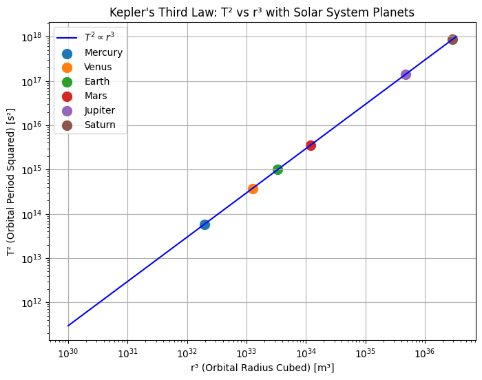
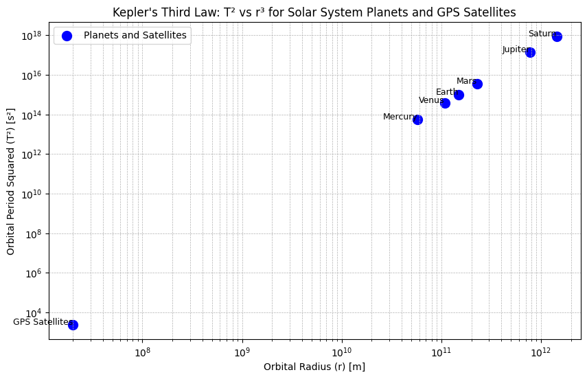
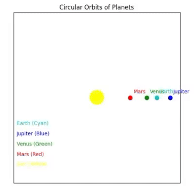

# **Kepler's Third Law**

Imagine that it's like the further a planet is from the Sun, the longer it takes to complete one full orbit. This is what Kepler's Third Law tells us: **T² ∝ r³**, meaning that the square of a planet's orbital period is directly proportional to the cube of its average distance from the Sun.

### **1. Derive the Relationship Between T² and r³**

We need two important concepts: **Gravitational Law** and **Centripetal Force**.

1. **Gravitational Law**:  
   The force between two objects is calculated like this:
   $$
   F = \frac{G M m}{r^2}
   $$
   Where:
   - **G**: Gravitational constant  
   - **M**: Mass of the Sun  
   - **m**: Mass of the planet  
   - **r**: Orbital radius

2. **Centripetal Force**:  
   The force required to keep an object moving in a circular path is:
   
   $$
   F = \frac{m v^2}{r}
   $$

3. We equate these two forces because the same force keeps the planet in orbit.

   $$
   \frac{G M m}{r^2} = \frac{m v^2}{r}
   $$

   We cancel out **m** from both sides.

   $$
   \frac{G M}{r^2} = \frac{v^2}{r}
   $$

4. Now, **velocity (v)** is the speed of the planet in orbit and is given by:

   $$
   v = \frac{2 \pi r}{T}
   $$

   Where **T** is the orbital period.

5. Substituting this into the first equation:

   $$
   \frac{G M}{r^2} = \frac{(2 \pi r / T)^2}{r}
   $$

6. Simplifying this, we get **T²** on its own:

   $$
   T^2 = \frac{4 \pi^2}{G M} r^3
   $$

And here we have:

$$T^2 \propto r^3$$

This means: The farther a planet is from the Sun, the longer it takes to complete one orbit.

[myColab](https://colab.research.google.com/drive/1KvD2OoyqhegYm7kTId9-nILshxJGT7e8)

----

## **2. Why This is Important in Astronomy**

Imagine you want to know how heavy a planet is or how far it is from the Sun. By using **Kepler's Third Law**, astronomers can calculate this! 

- If you know the **orbital period** (how long it takes the planet to orbit) and the **orbital radius** (how far the planet is), you can figure out things like the **planet's mass** and **distance** from the Sun.
  
- This law helps **predict orbital periods** because once we know the distance, we can calculate how long it takes for a planet to orbit. 

#### **Real-World Examples**:
- **GPS satellites**: They use this law to stay in the right orbit around Earth.
- **Planetary orbits**: It helps us understand how planets like Earth or Jupiter orbit the Sun.
- **Exoplanets**: When we find new planets outside our solar system, we use this law to estimate how long their year might be!

[myColab](https://colab.research.google.com/drive/10I0zOXoJa_HSjrEC-KCDV_JmEa3Kw-lN)

#### **What Does This Graph Show?**
The graph demonstrates the relationship between orbital period squared (T²) and orbital radius cubed (r³) for celestial bodies, illustrating Kepler's Third Law in action.

#### **Why Are GPS Satellites "Far" in the Graph?**
Although GPS satellites are close to Earth in reality, in the graph, they appear "far" because the scale of the orbital radii for planets is much larger, making the satellites' orbits look small in comparison.

---

## **3. Real-Life Examples & Analysis**

- **The Moon's Orbit vs. Other Planets**
  The Moon orbits Earth much faster than planets orbit the Sun because its orbital radius is much smaller.

- **Orbital Period (T) and Radius (r) for Some Planets**
  The farther a planet is from the Sun, the longer it takes to complete one orbit, as shown by Kepler's Law. For example, Earth takes 365 days, but Neptune takes about 165 years.

- **How Kepler's Law Works in These Cases**
  Kepler's Law holds true for both the Moon and planets: the farther an object is from the body it orbits, the longer its orbital period.

### What Does This Graph Show?

This graph illustrates Kepler's Law, showing the relationship between the orbital radius and orbital period of planets; as the orbital radius increases, the time it takes for a planet to complete its orbit also increases.

-----

### **4. Implement a Computational Model**

- **Simulate Circular Orbits**: Write a Python script that creates a simple model of planets moving in circular orbits.
- **Graph**: Create a graph showing the relationship between T² (orbital period squared) and r³ (orbital radius cubed).
- **Verify Kepler’s Law**: Check if the graph proves Kepler's Law by showing that T² is proportional to r³.

[myColab](https://colab.research.google.com/drive/16QqYmJJ-NsLDd_JoV8ITm81mWaClDwrf)

