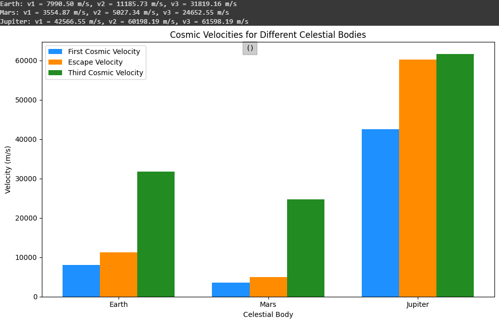

# Problem 2

# 🚀 Cosmic Velocities: 1st, 2nd, and 3rd Cosmic Speeds

## 🔸 1st Cosmic Velocity

**Definition:**  
The minimum velocity required for an object to orbit the Earth in a circular path without falling back to the surface.

**Formula:**

$$
v_1 = \sqrt{\frac{G \cdot M}{r}}
$$

**Parameters:**

- $v_1$: First cosmic velocity (m/s)  
- $G$: Gravitational constant ≈ $6.674 \times 10^{-11} \, \text{Nm}^2/\text{kg}^2$
- $M$: Mass of Earth ≈ $5.972 \times 10^{24} \, \text{kg}$  
- $r$: Radius of the Earth ≈ $6.371 \times 10^6 \, \text{m}$

>> This is the speed at which the gravitational force and the required centripetal force for orbit are balanced. The object stays in orbit without falling.

**Derivation of 1st Cosmic :**  
To derive $v_1$, we equate the gravitational force to the centripetal force required for circular orbit:  
- Gravitational force: 
$$
F_g = \frac{G \cdot M \cdot m}{r^2}
$$  
- Centripetal force: 
$$
F_c = \frac{m \cdot v_1^2}{r}
$$  
- Set $F_g = F_c$:  
  $$
  \frac{G \cdot M \cdot m}{r^2} = \frac{m \cdot v_1^2}{r}
  $$  
- Cancel \( m \) and multiply both sides by \( r \):  
  $$
  \frac{G \cdot M}{r} = v_1^2
  $$  
- Take the square root:  
  $$
  v_1 = \sqrt{\frac{G \cdot M}{r}}
  $$

---

## 🔸 2nd Cosmic Velocity

**Definition:**  
The minimum velocity required for an object to escape Earth's gravitational field and move into space.

**Formula:**

$$
v_2 = \sqrt{\frac{2 G \cdot M}{r}}
$$

**Parameters:**

- $v_2$: Second cosmic velocity (m/s)  
- $G, M, r$: Same as above

> This is the escape velocity. If an object reaches this speed, it will leave Earth’s gravity permanently without needing further propulsion.

**Derivation:**  
To derive \( v_2 \), we use conservation of energy, where kinetic energy equals the gravitational potential energy:  
- Kinetic energy: $$KE = \frac{1}{2} m \cdot v_2^2$$  
- Potential energy: $$PE = -\frac{G \cdot M \cdot m}{r}$$  
- Total energy at escape is zero: \( KE + PE = 0 \):  
  $$
  \frac{1}{2} m \cdot v_2^2 - \frac{G \cdot M \cdot m}{r} = 0
  $$  
- Simplify and cancel \( m \):  
  $$
  \frac{1}{2} v_2^2 = \frac{G \cdot M}{r}
  $$  
- Multiply by 2:  
  $$
  v_2^2 = \frac{2 G \cdot M}{r}
  $$  
- Take the square root:  
  $$
  v_2 = \sqrt{\frac{2 G \cdot M}{r}}
  $$

---

## 🔸 3rd Cosmic Velocity

**Definition:**  
The minimum velocity required for an object to escape not only Earth’s gravity but also the Sun’s gravitational pull, allowing it to leave the Solar System.

**Formula:**

$$
v_3 = \sqrt{\frac{2 G \cdot M_s}{R}}
$$

**Parameters:**

- $v_3$: Third cosmic velocity (m/s)  
- $G$: Gravitational constant  
- $M_s$: Mass of the Sun ≈ $1.989 \times 10^{30} \, \text{kg}$  
- $R$: Average distance from Earth to the Sun ≈ $1.496 \times 10^{11} \, \text{m}$

> This is the speed needed to escape the Solar System and continue toward interstellar space, like the Voyager 1 mission.

---

## ⚖️ Comparison Table

| Cosmic Velocity | Formula                                | Purpose                             | Approx. Speed |
|-----------------|----------------------------------------|-------------------------------------|----------------|
| 1st Velocity    | $\sqrt{ \frac{G M}{r} }$           | Enter orbit around Earth            | ~7.9 km/s      |
| 2nd Velocity    | $\sqrt{ \frac{2 G M}{r} }$         | Escape Earth’s gravity              | ~11.2 km/s     |
| 3rd Velocity    | $\sqrt{ \frac{2 G M_s}{R}}$      | Escape the Solar System             | ~16.7 km/s     |

---

[myColab](https://colab.research.google.com/drive/1uiOnaCDWHXjZfUy9RQ69LR58JifvRkQd#scrollTo=KXlw8YCmAYHn)

## 🔻Factors Affecting Cosmic Speeds

| **Cosmic Velocity**    | **Influencing Factor**     | **Effect**                                                                |
|------------------------|----------------------------|--------------------------------------------------------------------------|
| **1st Cosmic Velocity (v₁)** | **Distance from Surface (r)** | As the distance increases, the velocity decreases because gravitational force weakens. |
|                        | **Earth's Mass (M)**        | As Earth's mass increases, the velocity increases because gravitational force becomes stronger. |
|                        | **Gravitational Constant (G)** | The value of G is constant, but it affects the gravitational force.      |
| **2nd Cosmic Velocity (v₂)** | **Distance from Surface (r)** | As the distance increases, the velocity decreases because gravitational force weakens. |
|                        | **Earth's Mass (M)**        | As Earth's mass increases, the velocity increases because gravitational force becomes stronger. |
|                        | **Gravitational Constant (G)** | The value of G is constant, but it affects the escape velocity.          |
| **3rd Cosmic Velocity (v₃)** | **Distance (R - Earth-Sun)** | As the distance from the Sun increases, the velocity decreases because gravitational force weakens. |
|                        | **Sun's Mass (Mₛ)**         | As the Sun's mass increases, the velocity increases because the Sun's gravitational force becomes stronger. |
|                        | **Gravitational Constant (G)** | The value of G is constant, but it affects the gravitational force.      |

## 🚀 Why is it important for space exploration?

 **1st Cosmic Velocity**  
> The 1st cosmic velocity (7.9 km/s) puts satellites into orbit; it provides communication and observation.  
>  
 **2nd Cosmic Velocity**  
> The 2nd cosmic velocity (11.2 km/s) allows us to escape Earth and go to places like the Moon or Mars.  
>  
 **3rd Cosmic Velocity**  
> The 3rd cosmic velocity (16.7 km/s) makes it possible to leave the Solar System and reach the stars.  

## 📌 Summary  
Cosmic velocities are key to space exploration: the 1st (7.9 km/s) orbits Earth for satellites, the 2nd (11.2 km/s) escapes Earth for planetary missions, and the 3rd (16.7 km/s) breaks free of the Solar System for interstellar travel.