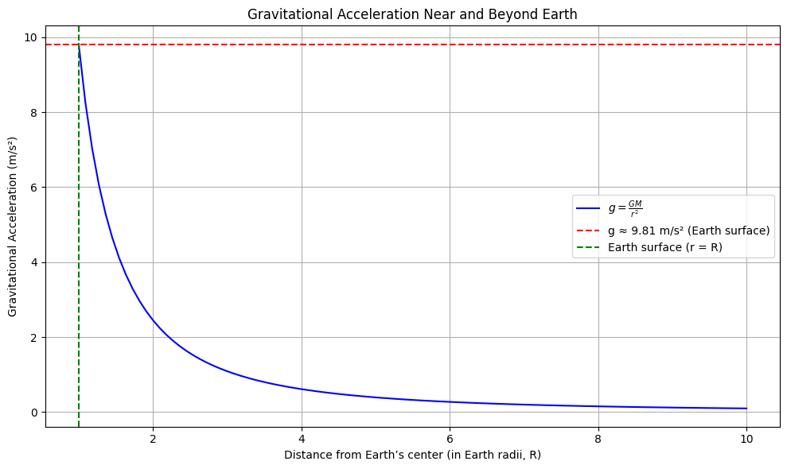
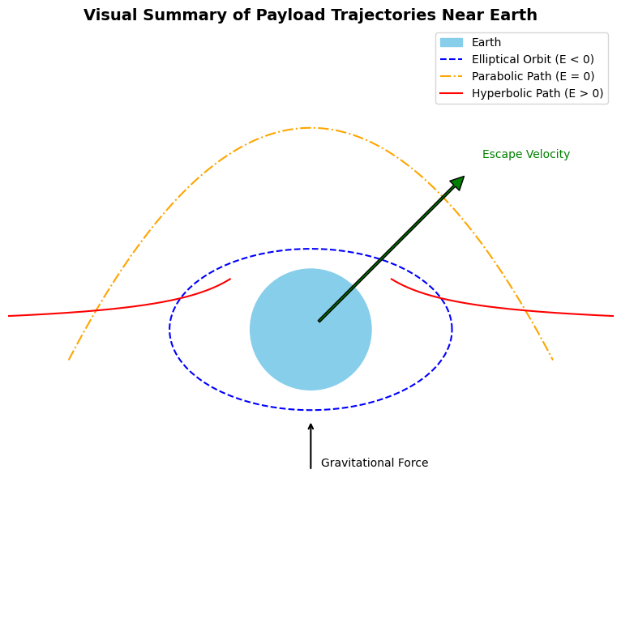
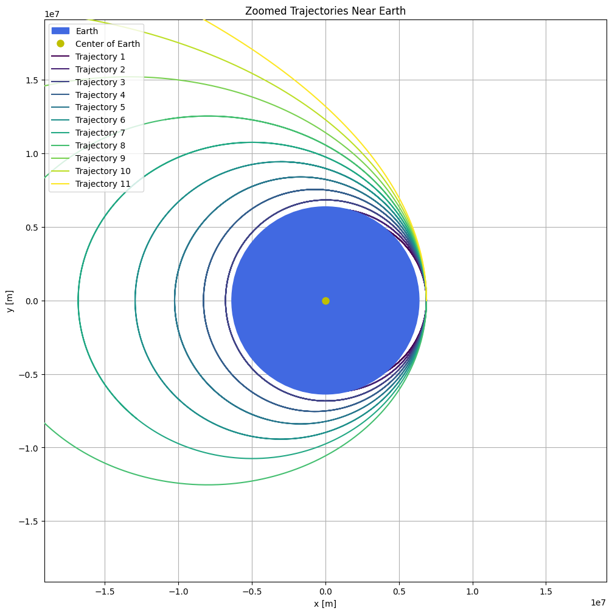
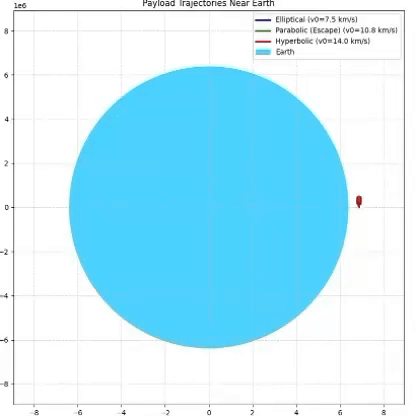

## 🚀 Trajectories of a Freely Released Payload Near Earth

## 🎯 Problem & Motivation

>When a payload is released from a moving spacecraft near Earth, it follows a path governed by the laws of gravitation and orbital mechanics. 

>This study investigates how varying initial velocities affect whether a payload follows an elliptical, parabolic, or hyperbolic trajectory.

###  🔵 Newton’s Law of Universal Gravitation

Newton's law defines the gravitational force between two masses:

$$F = \frac{G \cdot m_1 \cdot m_2}{r^2}$$

- **F**: Gravitational force  
- **G**: Gravitational constant ($6.674 \times 10^{-11} \, \text{Nm}^2/\text{kg}^2$)  
- **m₁, m₂**: Masses of the two objects  
- **r**: Distance between the centers of the two masses

>Newton's Law of Universal Gravitation describes how to calculate the gravitational force between two objects based on their masses and the distance between them.

---

### 🔵 Gravitational Acceleration Near Earth

Near Earth's surface, gravitational acceleration is approximately constant,
 and this formula illustrates how it's calculated using Earth's mass, radius, and the universal gravitational constant:

$$g = \frac{G \cdot M}{R^2}$$

- **g**: Gravitational acceleration ($\approx 9.81 \, \text{m/s}^2$)  
- **M**: Mass of Earth  
- **R**: Radius of Earth

[myColab](https://colab.research.google.com/drive/1Wc53ExkR7nvwacQz44JBb7iQmHrV9kFO)

---

### 🔵 Orbital Trajectories

The path of a payload depends on its total mechanical energy. There are three primary types of trajectories:

**1. Elliptical Orbit:**

- Total energy is negative ($E < 0$)  
- The object remains in a closed orbit around Earth  
- This is typical for satellites

**2. Parabolic Trajectory:**

- Total energy is zero ($E = 0$)  
- The object moves at exactly the escape velocity  
- This is the boundary between bounded and unbounded motion

**3. Hyperbolic Trajectory:**

- Total energy is positive ($E > 0$)  
- The object escapes Earth’s gravity completely  
- This occurs in interplanetary or interstellar missions

>v = 7500 m/s ⟶ Elliptical

>v = 11200 m/s ⟶ Parabolic

>v = 14000 m/s ⟶ Hyperbolic

[myColab](https://colab.research.google.com/drive/1-jYumlzHehTdF48dWj91Lr7OYSV2dQ6G)

---

### 🔵 Total Mechanical Energy of the Payload

The type of trajectory is determined by the total mechanical energy:

$$E = \frac{1}{2}mv^2 - \frac{G \cdot M \cdot m}{r}$$

- **E**: Total mechanical energy  
- **v**: Initial velocity of the object  
- **r**: Distance from Earth's center

[myColab](https://colab.research.google.com/drive/1m8khfbkP8bL-lrLzclHjgky3g_xMYSSw)

The animation below shows the trajectories of a payload for three different initial velocities: 

7.5 km/s(Elliptical),

10.8 km/s(Parabolic), and 
 
14 km/s(Hyperbolic).

[myColab](https://colab.research.google.com/drive/1Adt95dGbOY_ykc2aNoZqM8Obx-jJuvJE)

---

### 🔵 Escape Velocity

The minimum velocity required for an object to escape Earth's gravitational field:

$$v_e = \sqrt{\frac{2GM}{R}}$$

- At Earth's surface: $v_e \approx 11.2 \, \text{km/s}$

If the object's velocity exceeds this value, the trajectory becomes hyperbolic.

## 🚀 Summary

Depending on its initial velocity, a payload released near Earth will follow an elliptical, parabolic, or hyperbolic path due to the balance between gravitational force and kinetic energy.