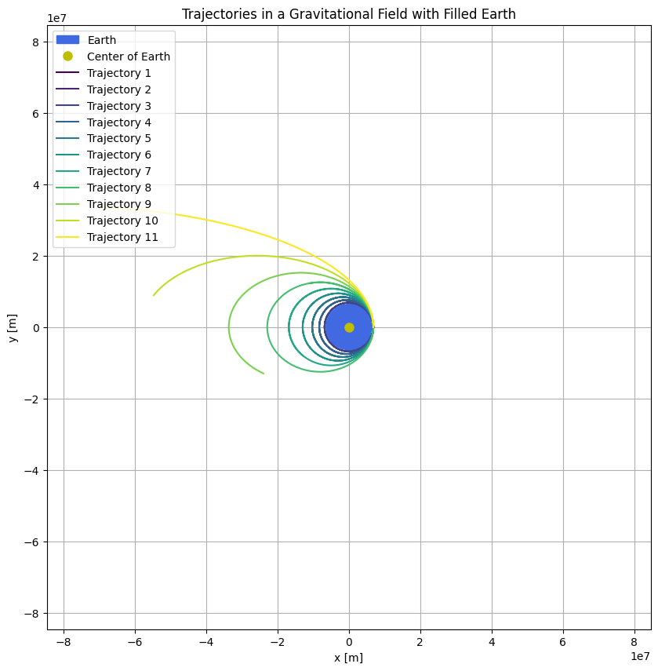

## 🚀 Trajectories of a Freely Released Payload Near Earth

###  🔵 Newton’s Law of Universal Gravitation

Newton's law defines the gravitational force between two masses:

$$F = \frac{G \cdot m_1 \cdot m_2}{r^2}$$

- **F**: Gravitational force  
- **G**: Gravitational constant ($6.674 \times 10^{-11} \, \text{Nm}^2/\text{kg}^2$)  
- **m₁, m₂**: Masses of the two objects  
- **r**: Distance between the centers of the two masses

>Newton's Law of Universal Gravitation describes how to calculate the gravitational force between two objects based on their masses and the distance between them.

---

### 🔵 Gravitational Acceleration Near Earth

Near Earth's surface, gravitational acceleration is approximately constant,
 and this formula illustrates how it's calculated using Earth's mass, radius, and the universal gravitational constant:

$$g = \frac{G \cdot M}{R^2}$$

- **g**: Gravitational acceleration ($\approx 9.81 \, \text{m/s}^2$)  
- **M**: Mass of Earth  
- **R**: Radius of Earth

[myColab](https://colab.research.google.com/drive/1Wc53ExkR7nvwacQz44JBb7iQmHrV9kFO)

---

### 🔵 Orbital Trajectories

The path of a payload depends on its total mechanical energy. There are three primary types of trajectories:

**1. Elliptical Orbit:**

- Total energy is negative ($E < 0$)  
- The object remains in a closed orbit around Earth  
- This is typical for satellites

**2. Parabolic Trajectory:**

- Total energy is zero ($E = 0$)  
- The object moves at exactly the escape velocity  
- This is the boundary between bounded and unbounded motion

**3. Hyperbolic Trajectory:**

- Total energy is positive ($E > 0$)  
- The object escapes Earth’s gravity completely  
- This occurs in interplanetary or interstellar missions

[myColab](https://colab.research.google.com/drive/1-jYumlzHehTdF48dWj91Lr7OYSV2dQ6G)

---

### 🔵 Total Mechanical Energy of the Payload

The type of trajectory is determined by the total mechanical energy:

$$E = \frac{1}{2}mv^2 - \frac{G \cdot M \cdot m}{r}$$

- **E**: Total mechanical energy  
- **v**: Initial velocity of the object  
- **r**: Distance from Earth's center

[myColab](https://colab.research.google.com/drive/1m8khfbkP8bL-lrLzclHjgky3g_xMYSSw)

---

### 🔵 Escape Velocity

The minimum velocity required for an object to escape Earth's gravitational field:

$$v_e = \sqrt{\frac{2GM}{R}}$$

- At Earth's surface: $v_e \approx 11.2 \, \text{km/s}$

If the object's velocity exceeds this value, the trajectory becomes hyperbolic.
