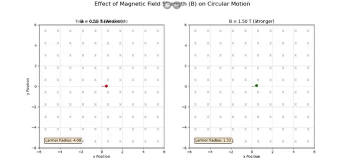

# Electromagnetism - Problem 1

# 1. Introduction – A Brief Overview of Electromagnetism

Electromagnetism is the branch of physics that studies the interaction between electric fields ($\vec{E}$) and magnetic fields ($\vec{B}$). Though they may seem separate, they combine to form one of the four fundamental forces of nature: the electromagnetic force.

---

## 🔌 What is an Electric Field?

An electric field is a force field created around charged particles. It represents the force per unit positive charge:

$$
\vec{E} = \frac{\vec{F}}{q}
$$

Where $q$ is the charge, and $\vec{F}$ is the electric force. Electric fields can accelerate or decelerate particles.

---

## 🧲 What is a Magnetic Field?

Magnetic fields are created by moving charges or magnets. Unlike electric fields, they do **not** affect stationary charges — only moving ones.

[myColab](https://colab.research.google.com/drive/1AI3QlOcuTWvGkD-KzhSS8rru_Uo1QQ6a)

---

## ⚡ Electromagnetic Force (Lorentz Force)

When both electric and magnetic fields are present, the total force on a charged particle is described by the Lorentz force:

$$
\vec{F} = q\vec{E} + q\vec{v} \times \vec{B}
$$

- $q$: Charge of the particle  
- $\vec{v}$: Velocity vector  
- $\vec{E}$: Electric field  
- $\vec{B}$: Magnetic field  

This force determines the particle’s trajectory.

[myColab](https://colab.research.google.com/drive/1llyBCYKfPJoWkxhIeYUAcDVPc90iMIgx)

---

## 🌍 Real-Life Applications of Electromagnetism

- **MRI machines** (manipulating atomic nuclei using magnetic fields)  
- **Electron microscopes** (steering particles with fields)  
- **Particle accelerators** (controlling charged particles' paths)  
- **Electromagnets**, electric motors, generators

elds.

---------
# 2. Applications of the Lorentz Force

The Lorentz force equation:

$$
\vec{F} = q\vec{E} + q\vec{v} \times \vec{B}
$$

shows how charged particles move under electric ($\vec{E}$) and magnetic ($\vec{B}$) fields. This principle is used in many technologies and scientific tools.

---

## 🔬 Where is the Lorentz Force Used?

### 1. Particle Accelerators  
Use electric and magnetic fields to control the speed and direction of particles at near-light speeds.  
➡️ Example: Large Hadron Collider (LHC)

### 2. Mass Spectrometers  
Identify materials by bending charged particles with magnetic fields. The radius of curvature depends on mass-to-charge ratio.

### 3. Plasma Confinement  
In fusion reactors like **tokamaks**, strong magnetic fields confine hot plasma.  
➡️ Magnetic fields control charged ions to avoid contact with walls.

---

## 💡 Why are $\vec{E}$ and $\vec{B}$ Fields Important?

- **Electric Fields ($\vec{E}$):** Push or pull charged particles, causing acceleration.  
- **Magnetic Fields ($\vec{B}$):** Change the direction of moving charges, causing circular or spiral motion.

Used together, these fields **precisely control** particle motion — speed, direction, and energy.

---

# 3. Simulating Particle Motion

To understand how the Lorentz force affects charged particles, we simulate their motion under different field configurations.

---

## ⚙️ Case 1: Uniform Magnetic Field ($\vec{B}$)

When only a magnetic field is present:

$$
\vec{F} = q \vec{v} \times \vec{B}
$$

- The particle moves in a **circular** path.
- The radius of the motion is called the **Larmor radius**:

$$
r = \frac{mv}{|q|B}
$$

- The frequency of rotation is the **cyclotron frequency**:

$$
\omega = \frac{|q|B}{m}
$$

[myColab](https://colab.research.google.com/drive/1s8eRWC73ed1olbk9kTlBoPHjhHJ_MfR5)

---

## ⚙️ Case 2: Uniform Electric and Magnetic Fields

When both fields are present and aligned:

$$
\vec{F} = q\vec{E} + q\vec{v} \times \vec{B}
$$

- Particles experience acceleration due to $\vec{E}$ and curved motion due to $\vec{B}$.
- The trajectory becomes a **helical path**.

[myColab](https://colab.research.google.com/drive/1zanH3Y8O4-4ieDM5cpskM9Z_J8xRmGg1)

---

## ⚙️ Case 3: Crossed Fields ($\vec{E} \perp \vec{B}$)

When electric and magnetic fields are perpendicular:

- The particle undergoes **drift motion**.
- The **drift velocity** is given by:

$$
\vec{v}_{\text{drift}} = \frac{\vec{E} \times \vec{B}}{B^2}
$$

This causes the particle to move in a spiral while drifting in a straight line.

---

➡️ By changing the configuration of $\vec{E}$ and $\vec{B}$ fields, we observe different types of motion:

- **Circular** (only $\vec{B}$)  
- **Helical** ($\vec{E}$ and $\vec{B}$ aligned)  
- **Drift** ($\vec{E} \perp \vec{B}$)

These simulations help visualize how the Lorentz force guides particles in real systems.

----

# 4. Parameter Exploration

To understand how different conditions affect particle motion, we explore various parameters in our simulations.

---

## 🔄 Adjustable Parameters

We vary the following quantities:

- **Electric field strength** ($|\vec{E}|$)
- **Magnetic field strength** ($|\vec{B}|$)
- **Initial particle velocity** ($\vec{v}_0$)
- **Particle charge** ($q$)
- **Particle mass** ($m$)

---

## 🌀 Effects on Trajectory

### 🧲 Magnetic Field Strength ($|\vec{B}|$)

- A stronger $\vec{B}$ reduces the Larmor radius:
  
$$
r = \frac{mv}{|q|B}
$$

- The particle spins faster due to increased cyclotron frequency:

$$
\omega = \frac{|q|B}{m}
$$

[myColab](https://colab.research.google.com/drive/1j18qgd_C-gsWL_Jq9drHLjZd3H_dJkDo)

---

### ⚡ Electric Field Strength ($|\vec{E}|$)

- A stronger $\vec{E}$ causes greater linear acceleration:

$$
\vec{F}_E = q\vec{E}
$$

- In crossed fields, drift velocity increases:

$$
\vec{v}_{\text{drift}} = \frac{\vec{E} \times \vec{B}}{B^2}
$$

[myColab](https://colab.research.google.com/drive/1I1BuEydkHXbAKbzygwbMUlj0tlD7akcI)

---

### 🚀 Initial Velocity ($\vec{v}_0$)

- Affects trajectory shape (radius, pitch of helix)
- Determines direction and magnitude of $\vec{v} \times \vec{B}$

[myColab](https://colab.research.google.com/drive/1xw8uOH0J_O59b1g_YRYpHTCA2WAeJp-K)

---

### 💥 Charge ($q$) and Mass ($m$)

- Trajectory depends on charge-to-mass ratio ($\frac{q}{m}$)
- Lighter or highly charged particles respond more quickly

[myColab](https://colab.research.google.com/drive/1z0D0XC-_IUYCOVh279vl2g-2HLy_p1Wc)

---

# 🔚 Summary – Understanding Particle Motion with Electromagnetic Fields

Electromagnetic fields guide charged particles through circular, helical, or drifting paths depending on the configuration of $\vec{E}$ and $\vec{B}$ fields.  
By adjusting parameters such as field strength, velocity, charge, and mass, we can fully control and visualize the trajectory of particles using the Lorentz force.

These concepts are crucial for applications in particle accelerators, plasma physics, and electromagnetic devices.
