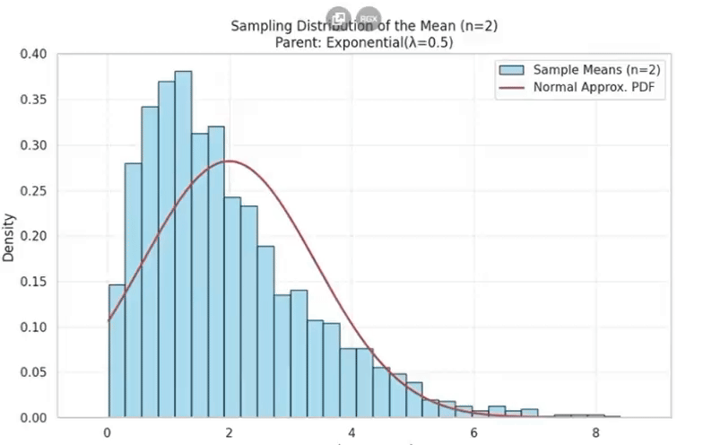
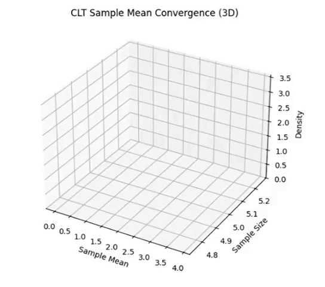
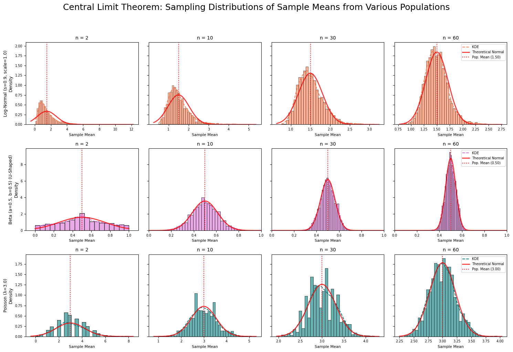

# 📊 Exploring the Central Limit Theorem through Simulations

## 🎯 Motivation

The **Central Limit Theorem (CLT)** states:

$$
\text{As } n \to \infty,\ \bar{X}_n \sim \mathcal{N}(\mu, \sigma^2/n)
$$

Even if the population distribution is not normal, the distribution of sample means tends to be normal as sample size increases.

Simulations allow us to see this transition **visually and intuitively**.

---

## 🔧 Task Overview

### 1. Simulating Sampling Distributions

- Define different population distributions:
  - Uniform
  - Exponential
  - Binomial

- Generate a large dataset for each distribution.

### 2. Sampling and Visualization

- For sample sizes: **5, 10, 30, 50**, draw many samples.
- Calculate the sample mean for each.
- Plot **histograms** of sample means.
- Observe **convergence to normality**.

### 3. Parameter Exploration

- Vary the population distribution and sample size.
- Analyze how **variance** affects the spread of sample means.
- Track the **rate of convergence**.

### 4. Practical Applications

- Estimating unknown population parameters
- Quality control in manufacturing
- Financial modeling and predictions

---

## 📈 Deliverables

- Python notebooks for simulations
- Histogram plots for different sample sizes
- Discussion section:
  - Visual evidence of CLT
  - Theoretical expectations vs empirical results

---

## 💡 Tips

- Use `NumPy`, `Matplotlib`, `Seaborn`.
- Start with **Uniform** or **Normal** distribution.
- Emphasize understanding of:
  
  $$
  \bar{X} = \frac{1}{n} \sum_{i=1}^{n} X_i, \quad \text{Var}(\bar{X}) = \frac{\sigma^2}{n}
  $$

---

## 🧠 Key Insight

As sample size increases:

- Shape of original distribution becomes **less important**
- Sampling distribution becomes **more normal**
- This justifies using **normal approximations** in real-life problems

---

