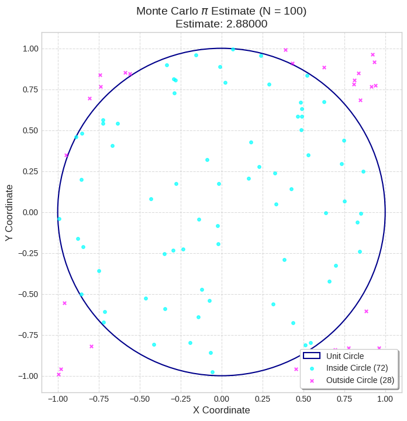
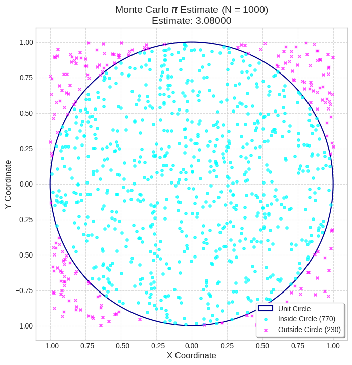
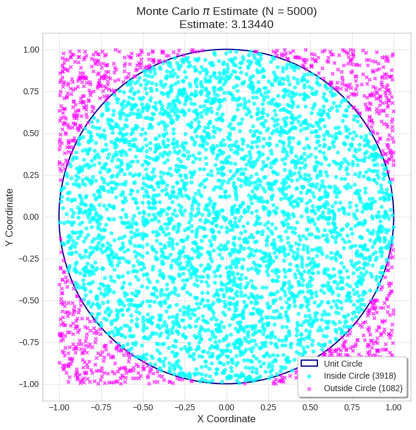
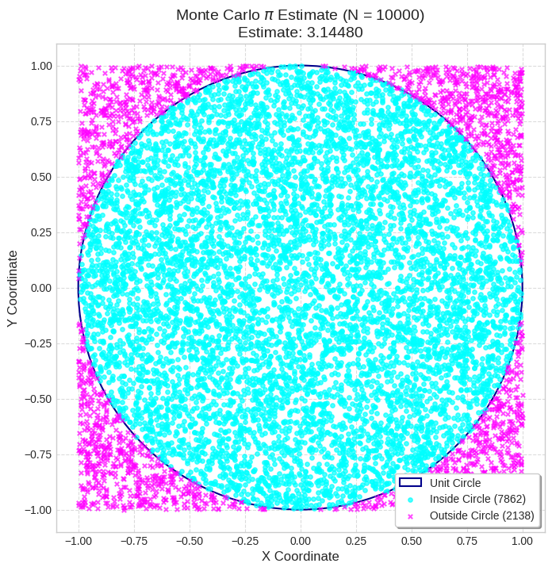
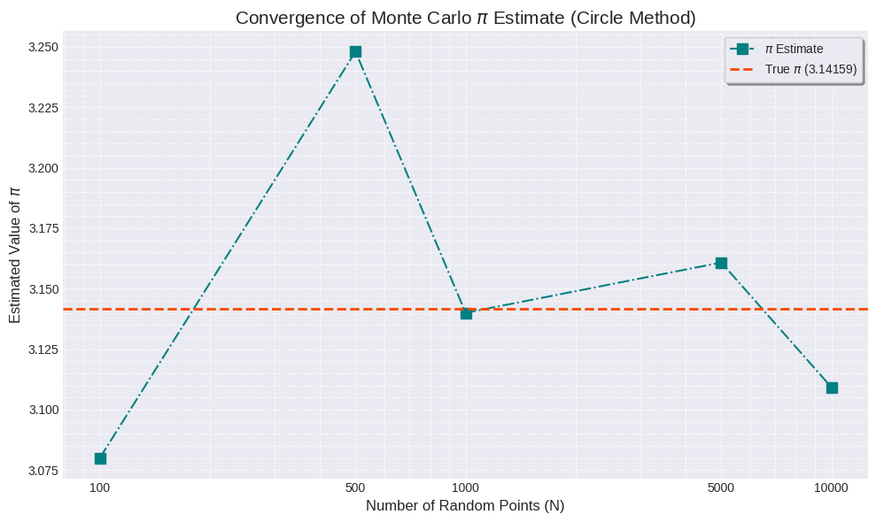
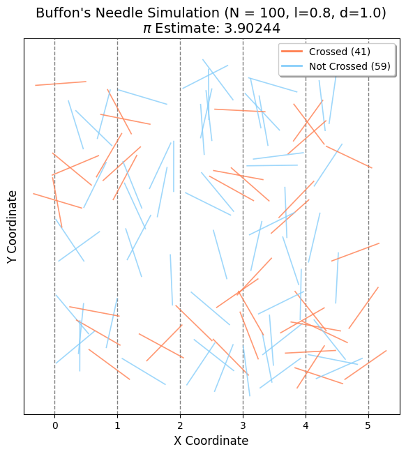
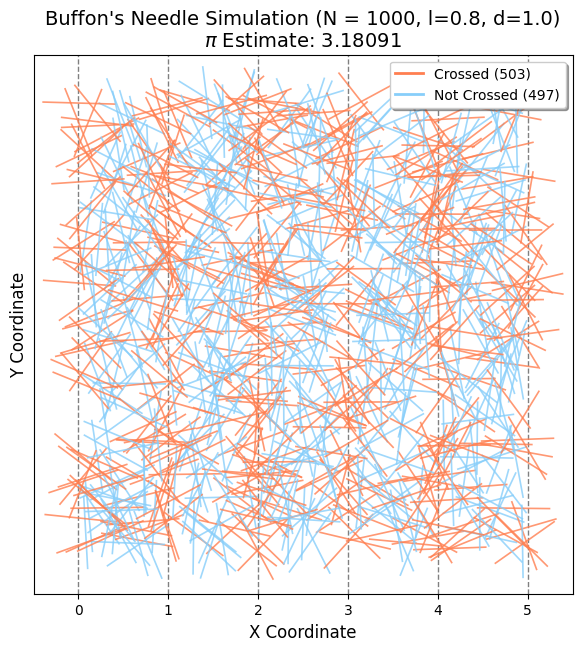
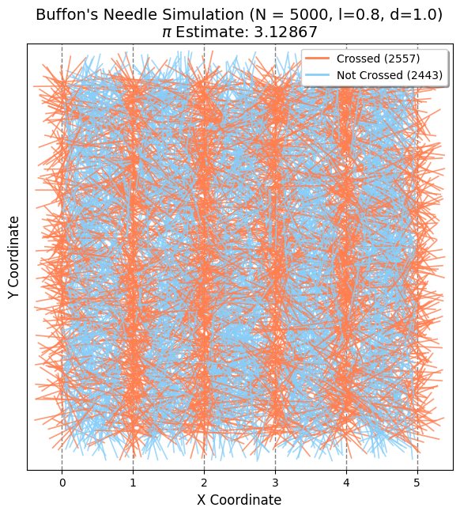
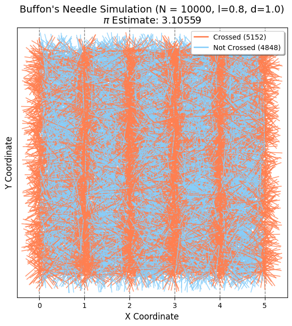
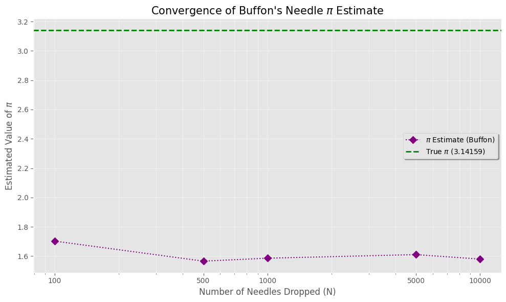

# 🎯 Estimating $\pi$ Using Monte Carlo Methods

---

## 🔵 Part 1: Circle-Based Monte Carlo Method

### 📄 Theoretical Foundation

A unit circle (radius = 1) inscribed in a square of side length 2 has:

- **Circle area**:  
  $$ A_{\text{circle}} = \pi r^2 = \pi $$

- **Square area**:  
  $$ A_{\text{square}} = (2r)^2 = 4 $$

By randomly generating points in the square and checking if they fall inside the circle:

- The ratio of points inside the circle approaches  
  $$ \frac{\pi}{4} $$

- Therefore:  
  $$ \pi \approx 4 \cdot \frac{\text{Points in circle}}{\text{Total points}} $$

[myColab](https://colab.research.google.com/drive/10lNz0Vt_Y4CEiFhsZ2aUjIvg7SjCwn3G#scrollTo=zmdGxzqC7KR7)

[myColab](https://colab.research.google.com/drive/1MKv4qoEBtmK1WvxiGaLFznF46RH6mAUD)

[myColab](https://colab.research.google.com/drive/1LDcOEVvrQD_sYS0kfB08TmX5rqj0xYXu)

[myColab](https://colab.research.google.com/drive/1Qvr63REL6XmpEO9N_8gJBaoNeN7LiL2P)

[myColab](https://colab.research.google.com/drive/1jHeHvalEVslLx4XG1drW5M6Atx054vlu)

---

## 🧵 Part 2: Buffon’s Needle Simulation

### 📄 Theoretical Foundation

Buffon's Needle experiment estimates $\pi$ by dropping a needle of length $l$ on a plane with parallel lines spaced $d$ units apart ($l \leq d$).

- The probability that the needle crosses a line is:  
  $$ P = \frac{2l}{d\pi} $$

- Rearranging gives:  
  $$ \pi \approx \frac{2l \cdot N}{d \cdot C} $$  
  where $N$ is total drops and $C$ is the number of crossings.

---

## ⚖️ Method Comparison

| Method               | Intuition                            | Accuracy         | Visualization |
|----------------------|---------------------------------------|------------------|---------------|
| Circle-Based         | Geometry-based ratio                  | Improves with $N$ | Easy          |
| Buffon’s Needle      | Probability from physical experiment  | Slower convergence | Moderate     |

---

## ✅ Conclusion

Both methods can estimate $\pi$, but the Circle-Based approach converges faster and is easier to implement and visualize. Buffon’s method is historically important and offers an elegant link between geometry and probability.

[myColab](https://colab.research.google.com/drive/1j3BvdcnQ2PVVswl0gvcQq_xkj16Pny1r)

[myColab](https://colab.research.google.com/drive/1OwChvzNFu7fNwHYO2UnuM5kyqO3UkMOs)

[myColab](https://colab.research.google.com/drive/1_f35ZTc5r2NxjJsBJL4-U8wiUHuS3IYf)

[myColab](https://colab.research.google.com/drive/1BYL9X-vwuiJv3Y1EyinR7KTfFeVhtYmy)

[myColab](https://colab.research.google.com/drive/1wbPynEbwNKtxM2dEqasXiZYp0AwdCwH2)